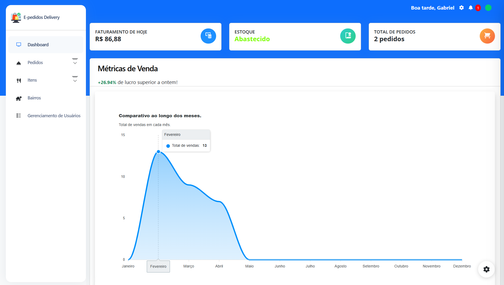
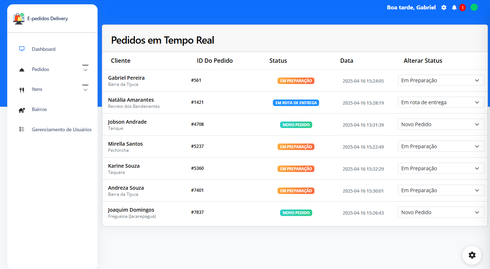
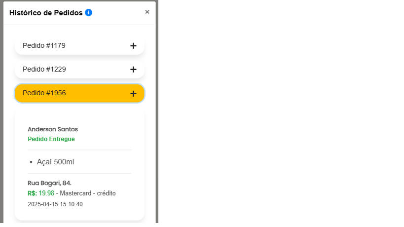

<p align="center"><a href="https://laravel.com" target="_blank"></a></p>

## 🛍️ E-pedidos Delivery
Sistema de pedidos online com painel administrativo completo, que oferece:

- Acompanhamento de pedidos em tempo real

- Controle de vendas e estoque

- Criação e gestão de cupons promocionais

- Dashboard interativo com métricas e gráficos de desempenho

Desenvolvido com Laravel e Livewire para uma experiência moderna e dinâmica tanto no front-end quanto no back-end.

## 🚀 Tecnologias Utilizadas no projeto

### 🖥️ Front-end
- HTML
- CSS
- JavaScript
- JQuery
- Bootstrap
- JQuery Toast Plugin

### ⚙️ Back-end
- PHP
- Laravel
- MySQL
- Ajax
- Livewire
- Laravel Charts
- MailTrap (simulação de envio de e-mails)
- Sistema de Controle de Acesso (ACL)

## ✨ Principais Funcionalidades

- Login com autenticação
- Recuperação de senha com envio de e-mail
- Validação de formulários
- Listagem e edição de dados
- Busca em tempo real de pedidos via Id ou nome do cliente
- Gerenciamento de pedidos em tempo real
- Alertas de baixo estoque, item desativado, delivery desligado
- Dashboard com comparativo de vendas ao longo dos meses
- Filtragem de vendas por mês
- Informações de itens mais vendidos
- Informações de bairros com mais vendas
- Comparativo de venda de hoje com as vendas de ontem
- Filtragem de endereço via API de Cep
- Realização de um novo pedido
- Acompanhamento de pedidos em tempo real (cliente)
- Verificação dos pedidos anteriores (Cliente)
- Escolha de quais adicionais podem ser postos em quais produtos
- Ativação/Desativação de produtos e bairros
- Ativação/Desativação do delivery
- Aplicação de cupons
- Notificações sobre problemas em estoque, delivery, bairros e produtos
- Escolha de motoboy para realizar cada entrega

Gerenciamento total (CRUD) de:

- Cupons
- Bairros
- Usuários
- Produtos, Adicionais para Produtos

O sistema possui 3 (três) tipos de usuário:

- Administrador
- Entregador
- Operador

## 🌐 O projeto está online!

Acesse o cardápio: [https://e-pedidosdelivery.online](https://e-pedidosdelivery.online)

Acesse a área administrativa: [https://e-pedidosdelivery.online/gerent](https://e-pedidosdelivery.online/gerent)


## 🛠️ Como rodar o projeto

1. Tenha em sua máquina um ambiente que faça a emulação de um servidor, como Xampp ou Docker instalado e parametrizado.
2. Clone o repositório:
```bash
git clone git@github.com:gabrieltec97/E-Pedidos-Delivery.git
```
3. Copie o arquivo .env.example para .env e configure as variáveis do banco de dados e do servidor de e-mails (MailTrap ou seu servidor).
4. Instale as dependências com o Composer:
```bash
composer install
```
5. Gere a chave de API do Laravel.
```bash
php (ou sail) artisan key:generate
```
6. Parametrize crie seu banco de dados e preenchendo com nome do banco, usuário, senha e porta no arquivo .env.
7. Rode as migrations e seeders necessárias para dar a configuração inicial para o sistema executar corretamente.
```bash
php (ou sail) artisan migrate --seed
```
8. Inicie o servidor.
```bash
php (ou sail) artisan serve
```
9. Pronto! Agora é só acessar http://localhost:8000

## 📸 Screenshots

<h4>Dashboard com informativo de vendas sobre os meses (Outras informações ao rolar a página no sistema).</h4>



<h4>Gestão de pedidos em tempo real.</h4>



<h4>Gestão de Produtos.</h4>


<h4>Cadastro de Bairro.</h4>


<h4>Acompanhamento de Pedido (Visão do Cliente).</h4>


<h4>Histórico de Pedidos (Visão do Cliente).</h4>


